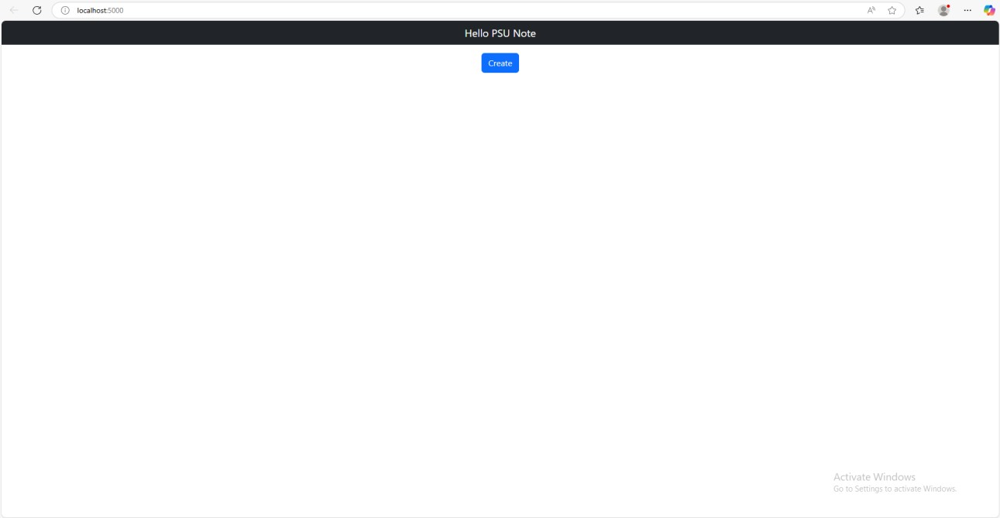
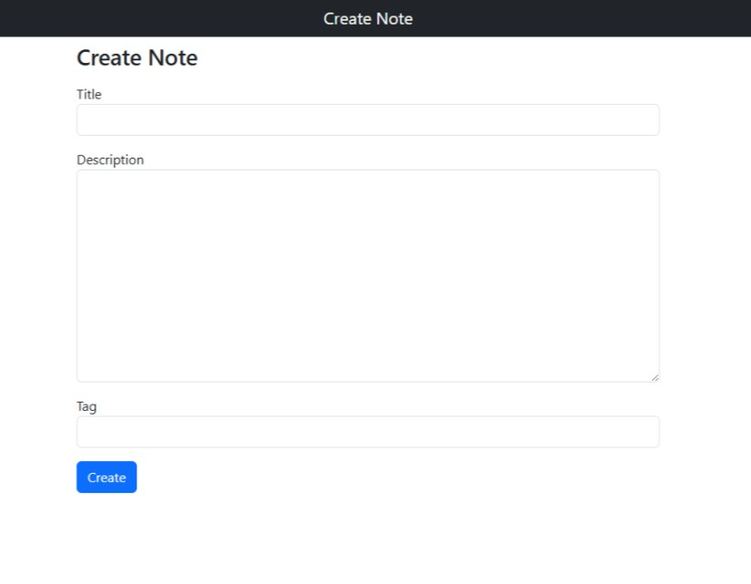
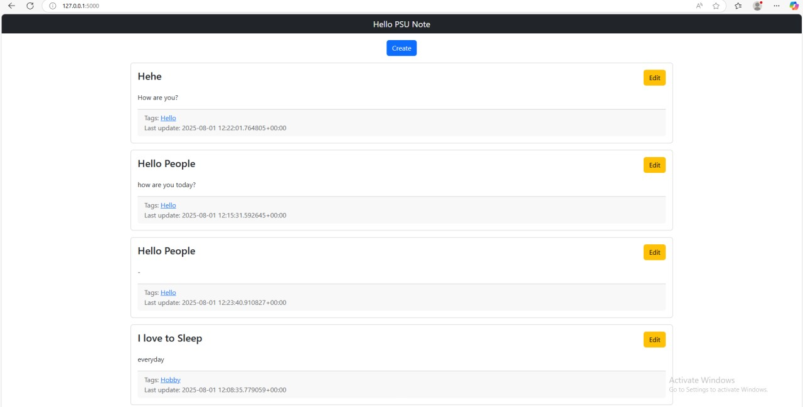
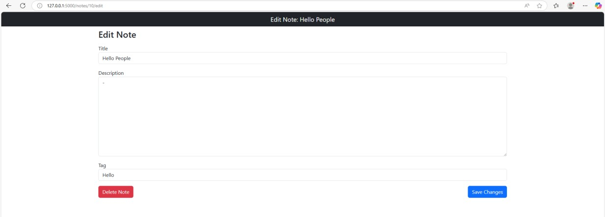
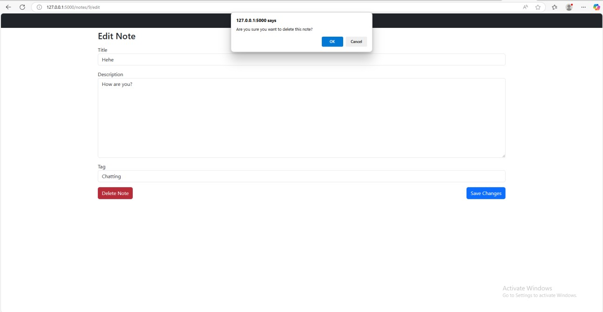

# PostgreSQL: PSUNote App

A simple web application built with Flask for creating, editing, and deleting notes with tags. It uses PostgreSQL as the database and SQLAlchemy for database interactions.

## Features

- **Notes Management**: Easily create, view, edit, and remove notes.
- **Tags Management**: Easily create, view, edit, and remove tags
- **Easy Tagging**: Add and manage tags for each note to help you sort them.
- **Tag Filtering**: Click on a tag to instantly see all the notes that have it.
- **Flexible Tag System**: One note can have many tags, and one tag can be used on many notes.
- **Safe Deletion**: A pop-up asks you to confirm before you delete a note, so you don't lose anything by mistake.

## System Requirements

- Docker 
- Python 3.x
- PostgreSQL

## Installation & Setup

### Option 1: Using Docker (Recommended)

1. **Clone the repository**
   ```bash
    git clone <repository-url>
   ```

2. **Start the services**
   ```bash
   docker-compose up -d
   ```

3. **Install Python dependencies**
   ```bash
   pip install -r requirements.txt
   ```

4. **Run the application**
   ```bash
   python psunote/noteapp.py
   ```
   You can now use the app at http://127.0.0.1:5000/

## Project Structure

- psunote/: The root directory of the project.
  - psunote/: The main application directory.
  
    - templates/: Contains HTML files for the user interface.
    
    - forms.py: Defines the forms used for user input.
    
    - models.py: Defines the database schema (e.g., the Note and Tag models).
    
    - noteapp.py: The core application file containing the main logic and routes.
  
  - pictures/: Stores application images.
  
  - requirements.txt: Lists all Python dependencies.

- docker-compose.yml: Configuration for running the application using Docker.

## Application Usage

### Creating a Note

1. On the homepage, click the **"Create"** button.


2. Fill out the Title, Description, and Tag fields.
3. Click the **"Create"** button to save your new note.



### Editing a Note
1. On the homepage, find the note you want to edit and click the **"Edit"** button.


2. This will take you to the edit page where you can edit or the **title**, **description**, or **tags**.
3. Click **"Save Changes"** to update the note.


### Deleting a Note
1. From the edit page, click the **"Delete Note"** button.
2. A confirmation dialog will appear. Click **"OK"** to permanently delete the note, or **"Cancel"** to go back.


### Deleting Tags
1. Go to the Edit page for each note that has the tag you want to delete.
2. In the Tag field, remove the tag name. 
3. Click **"Save Changes"**.
4. After you have removed the tag from the last note that used it, the application will automatically delete the tag from the database.

